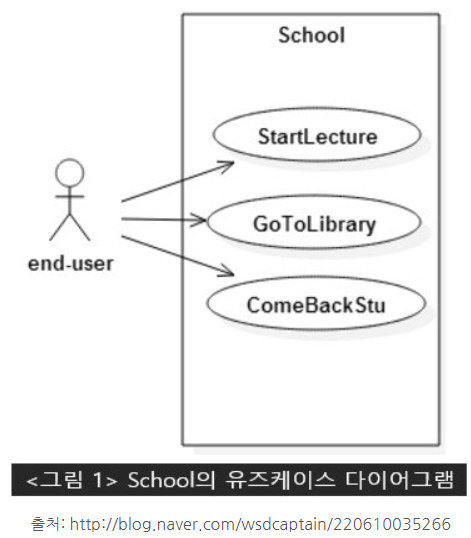

# 0715

## Use Case Diagram(유스케이스)
- 시스템 동작을 사용자 입장에서 표현한 **시나리오**
- 소프트웨어 기능을 개략적으로 설명

### 시스템 범위(scope)
- 큰 사각형: 개발하고자 하는 것

### 유스케이스
- 타원형: 서비스 or 기능\

### Actor
- 사람이 될 수도 있고, 외부 시스템이 될 수도 있다.
1. primary actor: 시스템을 사용함으로서 이득을 얻는 엑터. 보통 사람이므로 졸라맨으로 표시.
2. secondary actor: 프라이머리 엑터가 이득을 얻기 위해 도움을 주는 엑터로 보통 외부 시스템을 의미. 박스에 `<<actor>>` 입력하여 표기

### 관계(relationship)
1. 포함관계(필수적 관계)
   - 여러 유스케이스에서 중복되는 경우 따로 떼어내어 새로운 유스케이스를 만드는 경우를 포함관계
   - 화살표를 점선으로 연결하고 `<<include>>`를 표기
2. 일반화 관계
   - 보편적인 것
   - 끝부분이 삼각형인 화살표를 실선으로 연결
3. 확장 관계(선택적 관계)
  - 특정한 조건이 만족되는 경우만 실행
  - 화살표를 실선으로 연결하고 `<<extend>>`를 표기